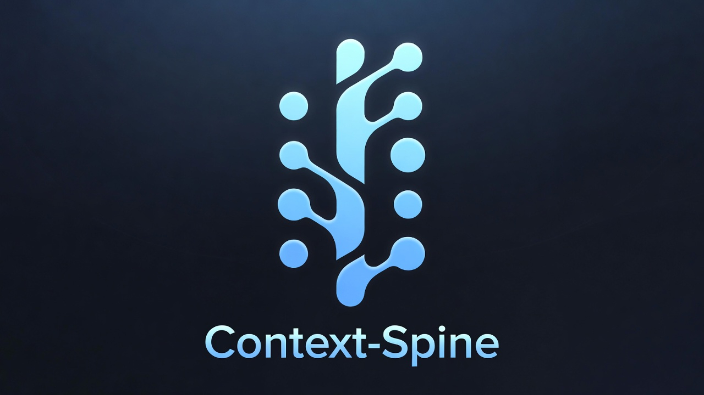

<p align="center">
  
</p>

<p align="center">
  <strong>Context Spine</strong><br>
  Durable repo-local memory and retrieval bootstrap for software projects.
</p>

<p align="center">
  
  
  
  
</p>

`Context Spine` is a reusable operating layer for keeping code, docs, notes, and evidence connected so people can restart, hand off, and search a project without relying on memory alone.

It is not a product scaffold. It is the working memory spine that sits next to the code and makes the project legible under growth, handoff, and context resets.

## At A Glance

| Signal | What it means |
| --- | --- |
| `Status` | Active reusable boilerplate for repo-local project memory |
| `Fit` | Existing repos, new repos, and agent-assisted workflows |
| `Core loop` | `bootstrap -> retrieve -> work -> synthesize -> re-index` |
| `Project stance` | Evidence-backed understanding over chat-history recall |

## How Teams Use It

| Scenario | What they add | What they get |
| --- | --- | --- |
| Existing repo cleanup | `meta/context-spine/`, `scripts/context-spine/`, one baseline note | Faster restarts and cleaner handoffs |
| Agent-heavy repo | `.pi/skills/`, evidence packs, bounded delegation | Better retrieval and less prompt soup |
| Deep technical system | ADRs, runbooks, diagrams, durable notes | Architectural shape that stays legible |

The goal is simple:

- lower the cost of getting a new project legible
- keep delivered behavior, documented intent, and trusted evidence connected
- make future sessions start from retrieval instead of rediscovery

## E.L.O.N.

Context Spine uses a simple doctrine for deciding whether a feature or memory surface is actually pulling its weight:

- **Evidence over aspiration**
- **Legibility over lore**
- **Optimize for utility x impact**
- **No blind inference**

Read the full doctrine in [docs/runbooks/elon-doctrine.md](./docs/runbooks/elon-doctrine.md).

## How People Use It

Context Spine is for normal project work, not just agent workflows.

People use it to:

- onboard faster with one baseline note and one recent session note
- hand off work without a long recap call
- capture decisions with code, test, and command evidence
- keep operational knowledge and architecture understanding easy to retrieve
- give agents a better project memory when agents are part of the workflow

Read the plain-language guide in [docs/runbooks/how-to-use-context-spine.md](./docs/runbooks/how-to-use-context-spine.md).

## What It Includes

- repo-local working memory under `meta/context-spine/`
- bootstrap and retrieval scripts under `scripts/context-spine/`
- evidence-pack discipline for delegated work under `scripts/delegation/`
- a generic agent constitution in [AGENTS.md](./AGENTS.md)
- a visual explainer surface under `.agent/diagrams/`
- starter ADRs, runbooks, and durable-note templates
- bundled Codex skill sources under [`.pi/skills/`](./.pi/skills/), including `context-spine` and `principal-engineer-review`
- optional extension points under `.pi/`

## Core Model

Context Spine is built around five layers:

1. live project truth
2. repo-local working memory
3. retrieval fabric
4. durable linked knowledge
5. bounded delegation with evidence

The system works when two loops exist at the same time:

- `read loop`: bootstrap -> hot memory -> retrieval -> source code
- `write loop`: code/tests/evidence -> synthesis note -> backlinks -> re-index

## Recommended Repo Shape

```text
<project-root>/
  AGENTS.md
  meta/
    context-spine/
  scripts/
    context-spine/
    delegation/
  docs/
    adr/
    runbooks/
    templates/
  .agent/
    diagrams/
  .pi/
    skills/
    prompts/
```

## Quick Start

The numbered commands below use the `npm run context:*` wrappers. If you do not want to use `npm`, use the direct-script equivalents listed immediately after.

1. Read the prerequisites in [docs/runbooks/prerequisites.md](./docs/runbooks/prerequisites.md).
2. Run `npm run context:init`.
3. Run `npm run context:bootstrap`.
4. Open [meta/context-spine/spine-notes-context-spine.md](./meta/context-spine/spine-notes-context-spine.md).
5. Use [meta/context-spine/hot-memory-index.md](./meta/context-spine/hot-memory-index.md) as the current working set.
6. Create a session note with `npm run context:session`.
7. Record observations with [scripts/context-spine/mem-log.py](./scripts/context-spine/mem-log.py).
8. Read or create a visual explainer when a subsystem is easier to absorb visually.
9. Keep one durable external note per major deep dive, audit, or execution baseline.
10. Refresh retrieval with `npm run context:update` and `npm run context:embed` when notes or docs change.
11. Optionally install or sync the bundled Codex skills with `npm run context:skill:install` if you want `$context-spine` or `$principal-engineer-review` available globally.
12. If you are updating an older install in another repo, run `python3 ./scripts/context-spine/upgrade.py --target /path/to/project`.

Direct-script equivalents remain available:

- `bash ./scripts/context-spine/init-qmd.sh`
- `bash ./scripts/context-spine/bootstrap.sh`
- `python3 ./scripts/context-spine/doctor.py`
- `python3 ./scripts/context-spine/rollout.py --repos /path/to/repo-a /path/to/repo-b`
- `python3 ./scripts/context-spine/upgrade.py --target /path/to/project`
- `python3 ./scripts/context-spine/mem-session.py --project context-spine`
- `python3 ./scripts/context-spine/mem-score.py --root ./meta/context-spine`
- `bash ./scripts/context-spine/qmd-refresh.sh --embed`
- `bash ./scripts/context-spine/install-codex-skill.sh`

## Drop Into An Existing Project

Read [docs/runbooks/project-drop-in.md](./docs/runbooks/project-drop-in.md).

If the project already has an older Context Spine install, use [docs/runbooks/upgrade-existing-project.md](./docs/runbooks/upgrade-existing-project.md) instead of treating it like a first install.

The short version:

- copy or vendor `meta/context-spine/`, `scripts/context-spine/`, `scripts/delegation/`, and `AGENTS.md`
- keep repo-local memory in the project repo
- keep durable notes in an external linked vault
- connect both through QMD or an equivalent retrieval layer
- do not wait for “perfect docs” before starting the loop

For the human workflow after installation, read [docs/runbooks/how-to-use-context-spine.md](./docs/runbooks/how-to-use-context-spine.md).

## Memory Lifecycle

Context Spine does not mean “commit every thought forever.”

The intended split is:

- durable: architecture, boundaries, baseline notes, ADRs, runbooks, curated evidence, selected diagrams
- rolling: active session notes and observations
- generated/local: retrieval indexes, hot-memory indexes, scorecards

Read the formal policy in [docs/adr/0003-memory-retention-model.md](./docs/adr/0003-memory-retention-model.md) and the operating rule in [docs/runbooks/memory-retention.md](./docs/runbooks/memory-retention.md).

## Durable Note Conventions

Default recommendation:

- `spine-notes-context-spine.md` for the current repo baseline
- `spine-notes-<topic>.md` for curated synthesis
- explicit `as_of` dates
- explicit `source_of_truth`
- a `Sources` section with direct paths or `qmd://` links

If a project already has a naming convention, keep it. The loop matters more than the prefix.

## Prerequisites

Run these exact checks first if you plan to use the README's `npm run ...` workflow:

```bash
git --version
python3 --version
bash --version
node --version
npm --version
command -v qmd && qmd status
```

If you want the direct-script path instead of `npm`, the shorter check is:

```bash
git --version
python3 --version
bash --version
command -v qmd && qmd status
```

If `qmd` is missing, install it with the official command:

```bash
npm install -g @tobilu/qmd
# or
bun install -g @tobilu/qmd
```

On macOS, QMD's official requirements also call for:

```bash
brew install sqlite
```

Source: [docs/runbooks/prerequisites.md](./docs/runbooks/prerequisites.md), [QMD Quick Start](https://github.com/tobi/qmd#quick-start), [QMD Installation](https://github.com/tobi/qmd#installation), and [QMD Requirements](https://github.com/tobi/qmd#requirements).

## Visual Reading Surface

Visual explainers are first-class in Context Spine, not decoration.

- store them under `.agent/diagrams/`
- pair them with durable notes or evidence
- let bootstrap surface recent explainers alongside hot memory

Read the workflow in [docs/runbooks/visual-explainers.md](./docs/runbooks/visual-explainers.md).

## Extensibility

Context Spine is meant to grow.

Recommended extension points:

- `.pi/skills/` for project-local skills
- `.pi/prompts/` for reusable prompt scaffolds
- `scripts/delegation/` for alternate delegate runtimes
- `docs/adr/` for architectural decisions
- `docs/runbooks/` for operational memory
- `.agent/diagrams/` for visual explainers

The rule is: extend by adding adapters and conventions, not by replacing the memory loop.

For the detailed `.pi/` model, read [docs/runbooks/pi-extension-points.md](./docs/runbooks/pi-extension-points.md).

## Codex Skills

This repo ships project-owned Codex skill sources under [`.pi/skills/`](./.pi/skills/), including:

- `context-spine`
  - memory bootstrap and repair
- `principal-engineer-review`
  - architectural oversight
- `context-spine-maintenance`
  - maintenance loop orchestration
- `memory-promotion`
  - deciding what recent work should become durable
- `multi-repo-rollout`
  - batch assessment of local repo installs
- `elon-doctrine`
  - judging whether a change is genuinely valuable or just more complexity

These skills are optional. Context Spine should still make sense and provide value to people even if no agent is involved.

- validate them with `npm run context:skill:validate`
- install or sync them into Codex with `npm run context:skill:install`
- see [docs/runbooks/codex-skill.md](./docs/runbooks/codex-skill.md) for the maintenance loop

If you maintain several local repos, use `npm run context:rollout -- --repos ...` and read [docs/runbooks/multi-repo-rollout.md](./docs/runbooks/multi-repo-rollout.md).

## Repository Status

This repository is the bootstrap itself. It should stay lean, generic, and evidence-oriented.
